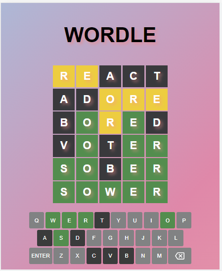

# Wordle Daily Challenge

Wordle Daily Challenge is a word-guessing game that presents players with a new target word every day. The objective of the game is to guess the correct word by making educated guesses based on feedback provided after each attempt. Built using HTML, CSS, and JavaScript, this project provides an enjoyable and interactive experience for players who want to test their vocabulary skills.

## Live App 
https://wordle-spell.netlify.app/

## Gameplay

- Each day, a new target word is generated for players to guess.
- Enter your guess into the input field and submit.
- After each guess, you will receive feedback indicating which letters are correct and in the correct position (green), and which letters are correct but in the wrong position (yellow).
- Use the feedback to refine your guesses and continue until you guess the correct word.
- The game keeps track of your attempts and displays your progress.
## Tech Stack

- **HTML:** Structure and layout of the game interface.
- **CSS:** Styling and visual design of the game.
- **JavaScript:** Game logic and interactivity.

## Getting Started
To get started with Wordle Daily Challenge, follow these steps:

- Clone the repository to your local machine: git clone https://github.com/DishuVerma/WORDLE.git
- Open the project folder.
- Open the index.html file in your preferred web browser.
- Start guessing the target word by entering your guesses in the input field provided.
- Read the feedback after each guess and adjust your subsequent guesses accordingly.
- Keep guessing until you find the correct word.
